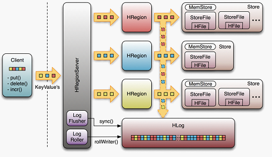

#HBase核心模块

## HBase的架构

### Client
 
 客户端是整个HBase系统的入口。使用者通过Client操作HBase。Client通过HBase的RPC机制与HMaster和RegionServer进行通信。
 
 HBase的操作分为管理类操作和数据读写等两大类操作。
 
 + 管理类操作（创建、删除、修改表操作之类等等），Client与HMaster进行RPC通信。
 + 数据读写操作，Client与RegionServer进行RPC交互。

 
### Zookeeper

ZooKeeper是HBase中协调服务组件。主要功能如下：

1. 负责管理HBase中多HMaster的选举，保证HBase集群中只有一个HMaster节点，服务器之间状态同步。
2. 存储HBase中的元数据信息（比如-Root-表的regsionServer信息）
3. 实时监控RegionServer
4. 存储所有的Region的寻址入口。

### HMaster

HMaster是HBase上的主节点。HMaster没有单点问题，在HBase中可以启动多个HMaster，通过Zookeeper中的Master选举机制保证总有一个Master正常运行并提供服务，其他HMaster作为备选时刻准备（当目前HMaster出现问题时）提供服务。HMaster主要负责Table和Region的管理工作：

+ 管理用户对Table的增、删、改、查操作。
+ 管理RegionServer的负载均衡，调整Region分布。
+ 在Region分裂后，负责新Region的分配。
+ 在RegionServer死机后，负责失效的RegionServer上的Region的迁移。

### HRegionServer

HRegionServer主要负责响应用户I/O请求，向HDFS文件系统中读写数据，是HBase中最核心的模块。HRegionServer内部管理了一系列HRegion对象，每个HRegion对应了Table中的一个Region。

#### HRegion 
HRegion由多个HStore组成，每个HStore对应了Table中的一个Column Family的存储。可以看出每个Column Family其实就是一个集中的存储单元，因此最好将具备共同I/O特性的列放在一个Column Family中，这样能保证读写的高效性。

#### HStore
 
 HStore存储是HBase的存储核心，由两部分组成：
 
 + MemStore
 + StoreFile
 
#### MemStore
 MemStore是Sorted Memoery Buffer，用户写入的数据首先放入MemStore中，当MemStore满了以后会flush成一个StoreFile（底层实现是HFile），当StoreFile文件数量增长到一定阀值，会触发Compact操作，将多个StoreFiles合并成一个StoreFile，在合并过程中会进行版本合并和数据删除，因此可以看出HBase其实只有增加数据，所有的更新和删除操作都是在后续的Compact过程中进行的，这使得用户的写操作只要进入内存中就可以立即返回，保证HBase I/O的高性能。
 
 StoreFiles在触发Compact操作后，会逐步形成越来越大的StoreFile，当单个StoreFile大小超过一定阀值后，会触发Split操作，同时把当前Region分裂成2个Region，父Region会下线，新分裂的2个子Region会被HMaster分配到相应的HRegionServer上，使得原先1个Region的压力得以分流到2个Region上。
 
#### HLog

每个HRegionServer中都有一个HLog对象，HLog是一个实现Write Ahead Log的类，在每次用户操作写入MemStore的同时，也会写一份数据到HLog文件中，HLog文件定期会滚动出新，并删除旧的文件（已持久化到StoreFile中的数据）。在HRegionServer意外终止后，HMaster通过Zookeeper感知到，首先处理遗留的HLog文件，将其中不同的Region的Log数据进行拆分，分别放到相应Region目录下，然后再将失效的Region重新分配，领取到这些Region的HRegionServer在加载Region的过程中，会发现现有历史HLog需要处理，因此会将HLog中数据回放到MemStore中，然后flush到StoreFiles，完成数据恢复。
