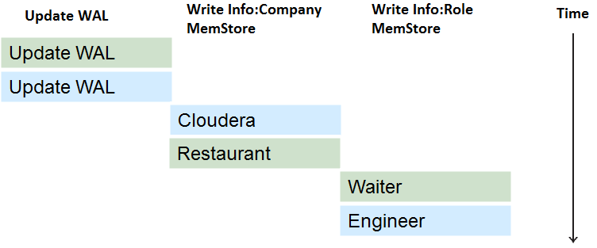
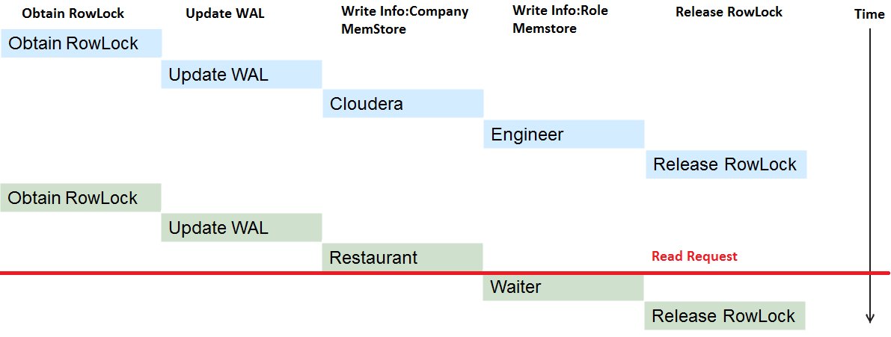
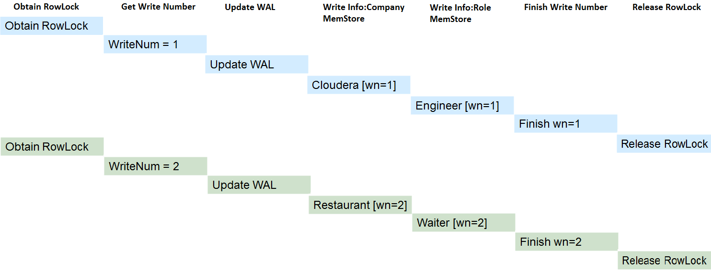

# HBase内部的锁与MVCC

[参考Apache HBase Internals: Locking and Multiversion Concurrency Control](https://blogs.apache.org/hbase/entry/apache_hbase_internals_locking_and)

本篇文章描述Apache HBase如何实现并发控制。在此，假设您已经了解了HBase的写顺序，关于HBase的写顺序更多细节，你可以参考[hbase-write-path](http://blog.cloudera.com/blog/2012/06/hbase-write-path/)。

[MVCC (Multiversion Concurrency Control)](https://en.wikipedia.org/wiki/Multiversion_concurrency_control)，即多版本并发控制技术，它使得大部分支持行锁的事务引擎，不再单纯的使用行锁来进行数据库的并发控制，取而代之的是，把数据库的行锁与行的多个版本结合起来，只需要很小的开销，就可以实现非锁定读，从而大大提高数据库系统的并发性能。

HBase正是通过行锁+MVCC保证了高效的并发读写。

## 为什么需要并发控制

HBase系统本身只能保证单行的ACID特性。ACID的含义是：

+ 原子性(Atomicity)
+ 一致性(Consistency)
+ 隔离性(Isolation)
+ 持久性(Durability)

为了理解HBase的并发控制，我们首先需要理解HBase为什么需要并发法控制。换句话说，什么属性保证了HBase的并发控制呢？

答案是HBase保证了[行级ACID语义](http://hbase.apache.org/acid-semantics.html)。

如果你有传统关系型数据库的经验，那么你对于这个术语会非常熟悉。传统关系型数据库是典型的对所有数据提供ACID语义的数据库。因为性能的原因，HBase仅仅提供基于行的ACID语义。如果你对于这个熟悉，没有关系，让我们看两个例子。

#### 写写同步

考虑两个并发写入HBase{company,role}组合:

图片中两次写操作，写到同一行上。

从[HBase Write Path](http://blog.cloudera.com/blog/2012/06/hbase-write-path/)，我们知道对于每次写操作，HBase都会执行如下操作：

1. 写Write-Ahead-Log(WAL)文件。
2. 写MemStore：将每个cell[(row,column)对]的数据写到内存的MemStore中。

我们写WAL的目是为了灾难恢复，然后更新内存中复制的数据。
现在，假设我们写操作没有并发控制，考虑以下事件的顺序：

图片2 是两次写操作顺序的一种可能性。

最后，我们剩下的状态如下：

我们并不能保证每次role都是相同的值。用ACID术语来说，我们没有为两次写提供隔离，所以两次写变得混乱。

显然，我们需要一些并发控制，一个简单的方案就是为每一行提供独占锁，来保证对同一行写的独立性。所以，我们的新写步骤如下(列表2)：

1. 获取行锁（RowLock）
2. 写Write-Ahead-Log(WAL)
3. 更新MemStore:将每个cell的数据写到MemStore
4. 释放行锁

#### 读写同步

到目前为止，我们已经添加的行锁，以写为了保证ACID语义。我们是否需要添加任何并发控制读？让我们考虑事件的另一个为了使我们的上述（请注意，此顺序遵循列表2规则）的例子：

图4 两次读写操作的一种可能性。

假如没有读的并发控制，我们在两次写操作的同时请求读。假定读出的直接执行“Waiter”之前被写入的memstore;此读出的动作是由上述一红色线条表示。在这种情况下，我们将再次读出的不一致行：

图片5. 缺少读-写同步的结果不一致性。

可见需要对读和写也进行并发控制，不然会得到不一致的数据。最简单的方案就是读和写公用一把锁。这样虽然保证了ACID特性，但是读写操作同时抢占锁会互相影响各自的性能。

HBase中使用了Multiversion Concurrency Control（MVCC）来避免读需要获取行级锁。MVCC在HBase中工作原理如下：

对于写操作：

 + (w1) 获取行锁后，每个写操作都立即分配一个写序号
 + (w2) 写操作在保存每个数据cell时都要带上写序号
 + (w3) 写操作需要申明以这个写序号来完成本次写操作

对于读操作：

+ (r1) 每个读操作开始都分配一个读序号，也称为读取点
+ (r2) 读取点的值是所有的写操作完成序号中的最大整数(所有的写操作完成序号<=读取点)
+ (r3) 对某个(row,column)的读取操作r来说，结果是满足写序号为“写序号<=读取点这个范围内”的最大整数的所有cell值的组合

在采用MVCC后的数据执行图:

注意到采用MVCC算法后，每一次写操作都有一个写序号(即w1步)，每个cell数据写memstore操作都有一个写序号(w2，例如：“Cloudera [wn=1]”))，并且每次写操作完成也是基于这个写序号(w3)。

如果在“Restaurant [wn=2]” 这步之后，“Waiter [wn=2]”这步之前，开始一个读操作。根据规则r1和r2，读的序号为1。根据规则3，读操作以序号1读到的值是：

这样就实现了以无锁的方式读取到一致的数据了。

重新总结下MVCC算法下写操作的执行流程：

 1. 获取行锁
 2. 获取写序号
 3. 写WAL文件
 4. 更新MemStore：将每个cell写入到memstore
 5. 以写序号完成操作
 6. 释放行锁

 本文是基于HBase 0.92. 在HBase 0.94中会有些优化策略，比如 [HBASE-5541](https://issues.apache.org/jira/browse/HBASE-5541) 提到的。
